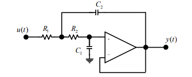
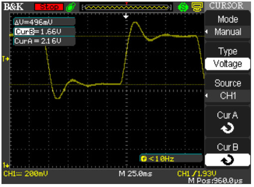
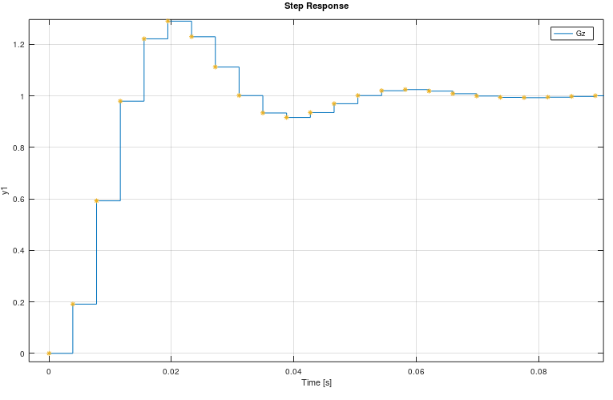
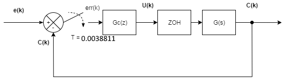
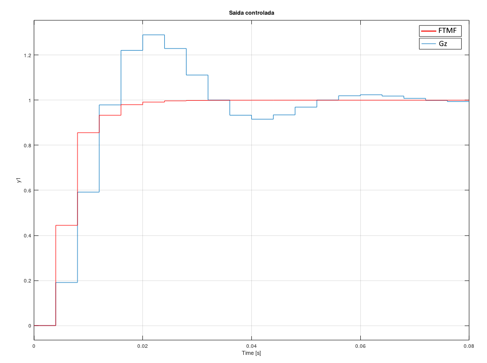
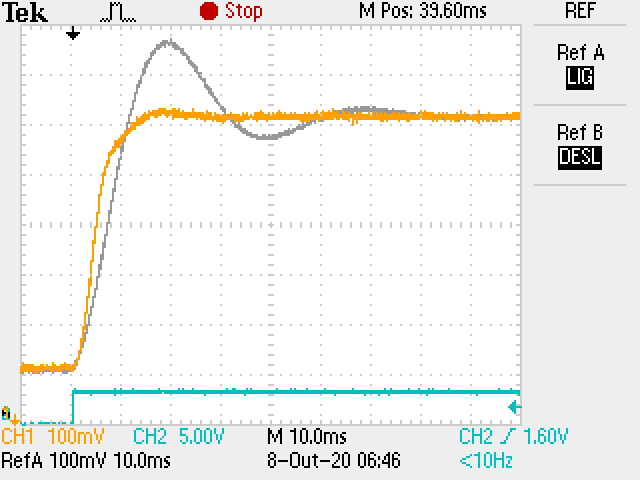
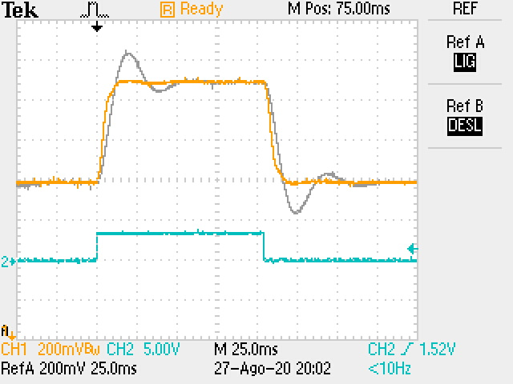

# controle_OCTAVE
Arquivos para automatização de cálculos de sistemas controle digitais utilizando root locus com Octave.

Dependências octave para estes arquivos:

- Python instalado no PATH do sistema com a biblioteca [SymPy](https://www.sympy.org/en/index.html).

- Pacote symbolic https://octave.sourceforge.io/symbolic/

## Projetos
Projetos de implementação foram baseados nos seguintes laboratórios da Texas Instruments

[Texas Instruments, 2019. C2000™ F2837xD Delfino Microcontroller Workshop](https://training.ti.com/c2000-f2837xd-microcontroller-workshop) Acessado 14/10/2020

[Texas Instruments, 2019. C2000™ F2802xD Piccolo Microcontroller Workshop](https://training.ti.com/c2000-f2802x-microcontroller-workshop?context=1137755-1139641-1137785) Acessado 14/10/2020

# Planta

# Resposta

# Discretização

# Controle

# Resultados Delfino

# Resultados Piccolo

